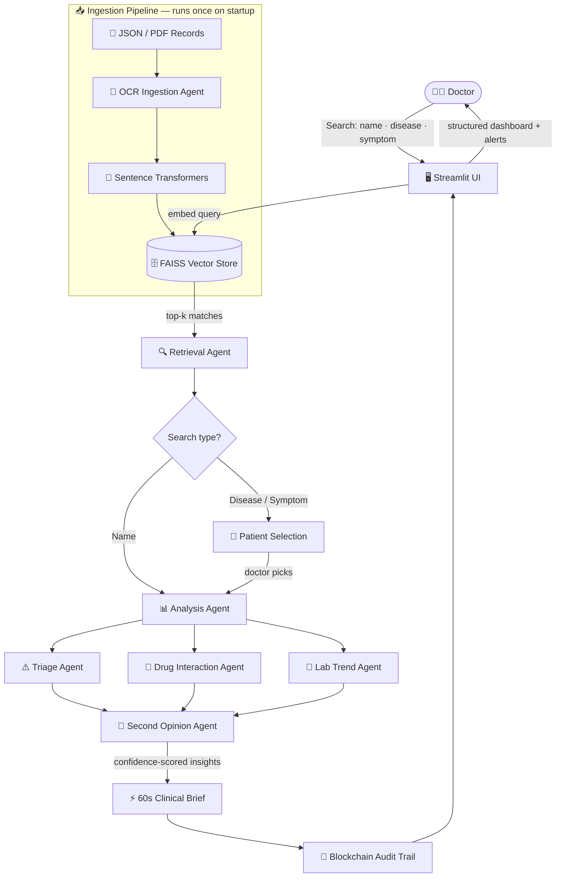

<div align="center">

<br/>

```
 ██████╗██╗     ██╗███╗   ██╗███████╗██╗ ██████╗ ██╗  ██╗████████╗     █████╗ ██╗
██╔════╝██║     ██║████╗  ██║██╔════╝██║██╔════╝ ██║  ██║╚══██╔══╝    ██╔══██╗██║
██║     ██║     ██║██╔██╗ ██║███████╗██║██║  ███╗███████║   ██║       ███████║██║
██║     ██║     ██║██║╚██╗██║╚════██║██║██║   ██║██╔══██║   ██║       ██╔══██║██║
╚██████╗███████╗██║██║ ╚████║███████║██║╚██████╔╝██║  ██║   ██║       ██║  ██║██║
 ╚═════╝╚══════╝╚═╝╚═╝  ╚═══╝╚══════╝╚═╝ ╚═════╝ ╚═╝  ╚═╝   ╚═╝       ╚═╝  ╚═╝╚═╝
```

**Clinical Intelligence, Accelerated.**

<br/>

> 🏆 **Domain Winners** — GLITCHCON 2.0 · National Hackathon at vellore institute of technology
> HackerRank × MellonAI × Kathir Memorial Hospital × Arpina Solutions
> **March 9–10, 2026 · MG Auditorium, VIT**

<br/>

[](https://www.python.org/)
[](https://streamlit.io/)
[](https://faiss.ai/)
[](https://sbert.net/)
[]()
[](LICENSE)

<br/>

[](https://lnkd.in/gYH92mzC)
[](https://lnkd.in/gXkV47Ef)

<br/>

</div>

---


## 🧬 What is ClinSight AI?

**ClinSight AI** is an **agentic clinical intelligence platform** that eliminates one of the most costly inefficiencies in modern hospitals:

> *Doctors walking into consultations without structured patient context.*

In busy hospital environments, a physician may manage hundreds of patients daily — each with dense, fragmented histories buried across case sheets, visit logs, lab reports, and prescription records. ClinSight deploys a **multi-agent AI pipeline** that automatically analyzes patient history, detects clinical risks, and generates a **60-second clinical brief** before the doctor even begins.

This isn't another AI chatbot. It's an **orchestrated clinical intelligence layer** — purpose-built for healthcare.

---

## 🏆 Recognition

<table>
  <tr>
    <td><b>Event</b></td>
    <td>GLITCHCON 2.0 — National-Level Hackathon</td>
  </tr>
  <tr>
    <td><b>Result</b></td>
    <td>🥇 Domain Winners</td>
  </tr>
  <tr>
    <td><b>Organized by</b></td>
    <td>HackerRank · MellonAI · Kathir Memorial Hospital · Arpina Solutions · WeLe · BITUMEN · ECDS · VITAA</td>
  </tr>
  <tr>
    <td><b>Venue & Date</b></td>
    <td>MG Auditorium, VIT — March 9–10, 2026</td>
  </tr>
</table>

---

## 🚨 Problem Statement

In busy clinical environments, doctors routinely manage hundreds of patients — each with dense, unstructured medical histories buried in case sheets, visit logs, and diagnostic reports.

| Pain Point | Reality |
|---|---|
| ⏱️ **Time-consuming** | Manually scrolling through records wastes critical minutes during consultations |
| 🔍 **Keyword-limited** | Traditional search misses semantic context — "fatigue" won't surface "chronic tiredness" |
| 🧩 **Fragmented** | Patient data is scattered across diagnoses, prescriptions, lab reports, and visit notes |
| ⚠️ **Error-prone** | Cognitive overload leads to missed drug interactions and overlooked patterns |
| 🔒 **Unaudited** | No traceable log of who accessed what clinical insight, when, and why |

> **There is no intelligent layer between the doctor and the data. ClinSight is that layer.**

---

## 💡 Solution Overview

**ClinSight AI** bridges this gap by deploying a **multi-agent AI infrastructure** over patient medical records. Doctors query the system in plain English — by name, disease, or symptom — and receive a fully structured clinical brief in under 60 seconds.

The platform uses **Retrieval-Augmented Generation (RAG)**: patient records are embedded as semantic vectors, stored in a FAISS index, and retrieved via similarity search. A pipeline of **7 specialized agents** then handles analysis, triage, OCR ingestion, drug interaction detection, second-opinion generation, and more — all grounded in real patient data.

---

## 🤖 Multi-Agent Architecture

ClinSight deploys **7 specialized AI agents**, each owning a distinct part of the clinical intelligence pipeline:

| Agent | Role |
|---|---|
| 🔍 **Retrieval Agent** | Semantic search across patient records using FAISS vector similarity |
| 📊 **Analysis Agent** | Structures raw patient data into coherent clinical profiles |
| ⚠️ **Triage Agent** | Detects high-risk conditions and flags critical patients automatically |
| 💊 **Drug Interaction Agent** | Cross-references prescriptions for dangerous drug combinations |
| 🧪 **Lab Trend Agent** | Analyzes lab value trajectories and surfaces anomalies over time |
| 🔬 **Second Opinion Agent** | Generates evidence-backed differential diagnoses with confidence scores |
| 📄 **OCR Ingestion Agent** | Parses scanned PDF case sheets into structured patient records |

---

## 🏗️ System Architecture



---

## ✨ Key Features

| Feature | Description |
|---|---|
| ⚡ **60-Second Clinical Brief** | Full patient context generated instantly on selection — before the consultation begins |
| 🤖 **7-Agent Pipeline** | Specialized agents for analysis, triage, OCR, drug interactions, lab trends, and second opinions |
| 🔍 **Semantic Search** | Search by name, disease, or symptom in natural language — not just exact keywords |
| 💊 **Drug Interaction Detection** | Automatically cross-references the full prescription list for dangerous combinations |
| 🧪 **Lab Trend Analysis** | Detects deteriorating or anomalous lab value trajectories over time |
| 🔬 **Second Opinion AI** | Evidence-backed differential diagnoses with explicit confidence scores |
| 🔐 **Blockchain Audit Trail** | Every clinical action is immutably logged for compliance and accountability |
| 👥 **Multi-Patient Retrieval** | Disease queries return a ranked list of all matching patients to choose from |
| 📊 **Clinical Dashboard** | Structured view: profile · diagnosis · medications · lab history · visit log |
| 🤝 **Patient-Side Intelligence** | Patients receive structured summaries and recommendations from their own reports |
| 🗂️ **PDF + JSON Support** | Works with structured JSON datasets and scanned PDF case sheets via OCR |
| 🔒 **On-Device Processing** | All embeddings run locally — no patient data leaves your infrastructure |

---

## 🛠️ Tech Stack

| Layer | Technology | Purpose |
|---|---|---|
| **Frontend / UI** | [Streamlit](https://streamlit.io/) | Clinical dashboard, search interface, and patient selection UI |
| **Embeddings** | [Sentence Transformers](https://sbert.net/) `all-MiniLM-L6-v2` | Semantic vector representations for patients and queries |
| **Vector Store** | [FAISS](https://faiss.ai/) | High-speed approximate nearest-neighbor similarity search |
| **Agent Orchestration** | Custom Multi-Agent Pipeline | 7 specialized agents coordinating analysis, triage, and insight generation |
| **Drug Safety** | Drug Interaction Agent | Cross-reference layer on active prescriptions |
| **Document Parsing** | OCR Ingestion Agent | Structured extraction from scanned PDFs and case sheets |
| **Audit Layer** | Blockchain Trail | Immutable logging of all clinical access and actions |
| **Data Layer** | JSON + PDF Medical Records | Profile · diagnosis · prescriptions · visits · labs |
| **Language** | Python 3.10+ | Core application runtime |

---

## ⚡ Installation & Setup

### Prerequisites

- Python **3.10** or higher
- `git` installed
- Your JSON medical dataset file

### 1. Clone the Repository

```bash
git clone https://github.com/shreyashgautam/clinsight-ai.git
cd clinsight-ai
```

### 2. Create a Virtual Environment

```bash
python -m venv venv

# macOS / Linux
source venv/bin/activate

# Windows
venv\Scripts\activate
```

### 3. Install Dependencies

```bash
pip install -r requirements.txt
```

### 4. Add Your Dataset

```
clinsight-ai/
└── data/
    ├── patients.json        ← structured patient records
    └── case_sheets/         ← scanned PDFs (optional, for OCR agent)
```

> 📌 See `data/sample_patients.json` for the expected record schema.

### 5. Configure Environment

```bash
cp .env.example .env
```

Edit `.env` to set your dataset path, blockchain node config, and any custom values.

---

## ▶️ How to Run

```bash
streamlit run app.py
```

The app launches at **`http://localhost:8501`** in your browser.

**On first launch:**
1. The system automatically **ingests and indexes** all patient records from your dataset
2. The OCR agent processes any PDF case sheets in `data/case_sheets/`
3. Embeddings are generated once and **cached** for subsequent runs
4. The full 7-agent search interface is ready as soon as indexing completes

---

## 💬 Example Queries

```
👤 Patient Name Search
→ "Arjun Sharma"
→ "Priya Mehta"

Returns: 60-second dashboard — profile, diagnosis, medications,
         drug interaction alerts, lab trends, second opinion.

🦠 Disease / Condition Search
→ "Type 2 Diabetes"
→ "hypertension"
→ "iron deficiency anemia"

Returns: Ranked list of matching patients.
         Select any to view their full clinical brief.

🔬 Complex Semantic Search
→ "fatigue history with iron deficiency"
→ "post-surgical patient with abnormal creatinine"

Returns: Semantically matched patients — even if the exact
         words don't appear anywhere in the record.
```

---

## 📁 Project Structure

```
clinsight-ai/
│
├── app.py                      # Streamlit UI — search, dashboard, patient selection
├── rag_pipeline.py             # RAG logic — ingestion, embedding, FAISS, retrieval
├── agents/
│   ├── analysis_agent.py       # Patient history structuring
│   ├── triage_agent.py         # High-risk detection and alerting
│   ├── drug_interaction.py     # Prescription cross-reference
│   ├── lab_trend_agent.py      # Lab value trajectory analysis
│   ├── second_opinion.py       # Evidence-backed differential generation
│   └── ocr_agent.py            # PDF case sheet ingestion
├── insight_engine.py           # Orchestrates all 7 agents → clinical brief
├── blockchain/
│   └── audit_trail.py          # Immutable clinical action logging
├── data/
│   ├── patients.json           # Medical records dataset
│   ├── sample_patients.json    # Example schema for reference
│   └── case_sheets/            # PDF inputs for OCR ingestion
├── requirements.txt
├── .env.example
├── .gitignore
└── README.md
```

---

## 👥 Team

Built over 48 hours at VIT by **Team Fanatics** 🔥

<table>
  <tr>
    <td align="center"><b>Dipsita Rout</b><br/><a href="https://www.linkedin.com/in/dipsita-rout/">LinkedIn ↗</a></td>
    <td align="center"><b>Meghna Mandawra</b><br/><a href="https://www.linkedin.com/in/meghna-mandawra-b4083228b/">LinkedIn ↗</a></td>
    <td align="center"><b>Riddhi Arora</b><br/><a href="https://www.linkedin.com/in/itsriddhiarora/">LinkedIn ↗</a></td>
    <td align="center"><b>Shreeya Kollipara</b><br/><a href="https://www.linkedin.com/in/shreeya-kollipara-47a42128b/">LinkedIn ↗</a></td>
    <td align="center"><b>Shreyash Gautam</b><br/><a href="https://www.linkedin.com/in/shreyash-gautam/">LinkedIn ↗</a></td>
  </tr>
</table>

---

## 🚀 Future Roadmap

- [ ] 🌐 **Multi-language Support** — Hindi, Tamil, and other regional languages
- [ ] 📈 **Health Trend Visualization** — Charts for vitals, labs, and visit frequency over time
- [ ] 🔐 **Role-Based Access Control** — Separate doctor, nurse, and admin access levels
- [ ] ☁️ **Persistent FAISS Index** — Save and reload the index across sessions without re-ingestion
- [ ] 📊 **Confidence Scores on Search** — Retrieval relevance scores shown alongside each result
- [ ] 🔔 **Real-Time Critical Alerts** — Auto-surface deteriorating patients based on vitals or interactions
- [ ] 🐳 **Docker Deployment** — One-command containerized setup for hospital IT environments
- [ ] 🧪 **RAGAS Evaluation** — Faithfulness and relevance scoring for all retrieved insights
- [ ] 🔄 **Streaming Summaries** — Token-by-token streaming for faster perceived response time
- [ ] 📱 **Mobile-First Clinical View** — Lightweight dashboard for ward-round tablet use

---

## 📄 License

MIT License — see [LICENSE](LICENSE) for details.

---

<div align="center">

<br/>

**Built in 48 hours to make clinical intelligence accessible to every doctor.**

*ClinSight AI — Vabhravi Pandey*

<br/>

[](https://lnkd.in/gYH92mzC)
[](https://lnkd.in/gXkV47Ef)

<br/>

*If ClinSight AI helps your workflow, give it a ⭐ on GitHub — it helps other clinicians and developers find the project.*

</div>
